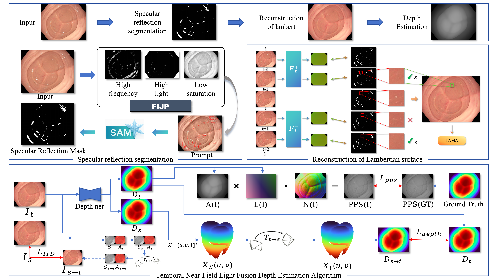

# SPECULAR-AWARE LAMBERT RECONSTRUCTION FOR MONOCULAR ENDOSCOPIC DEPTH ESTIMATION


## Environment
- Python 3.11
- PyTorch 2.7.0
- CUDA 12 (推荐使用 NVIDIA GPU 加速)

```bash
conda create -n myenv python=3.11
conda activate myenv
pip install -r requirements.txt
